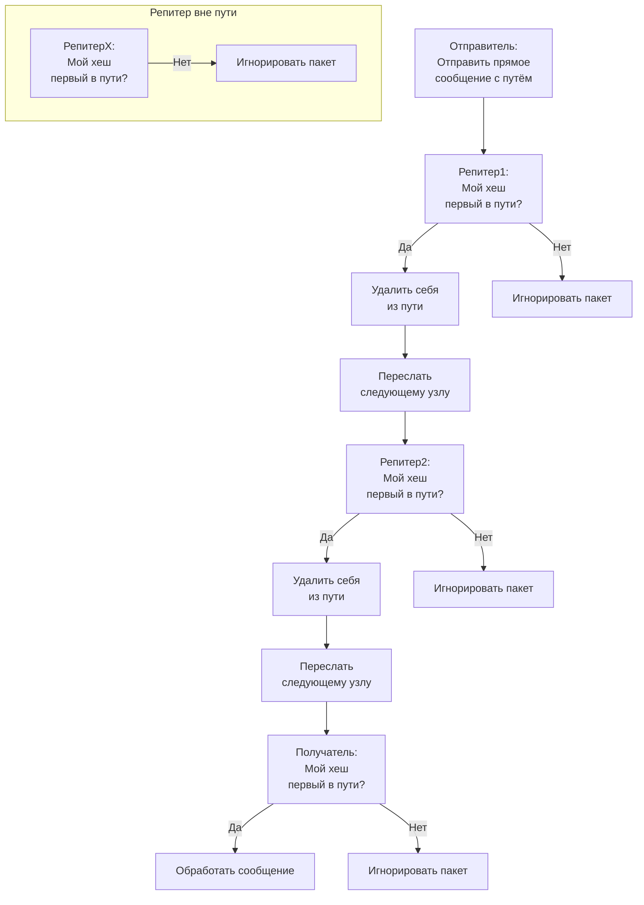
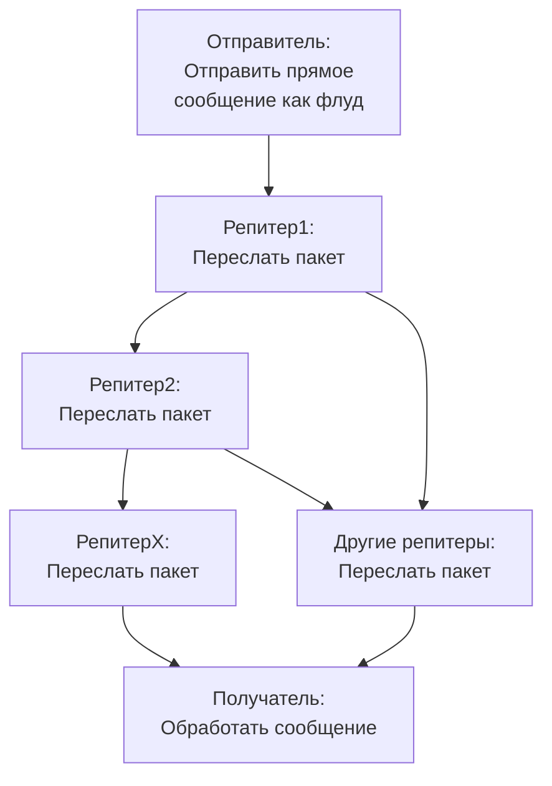
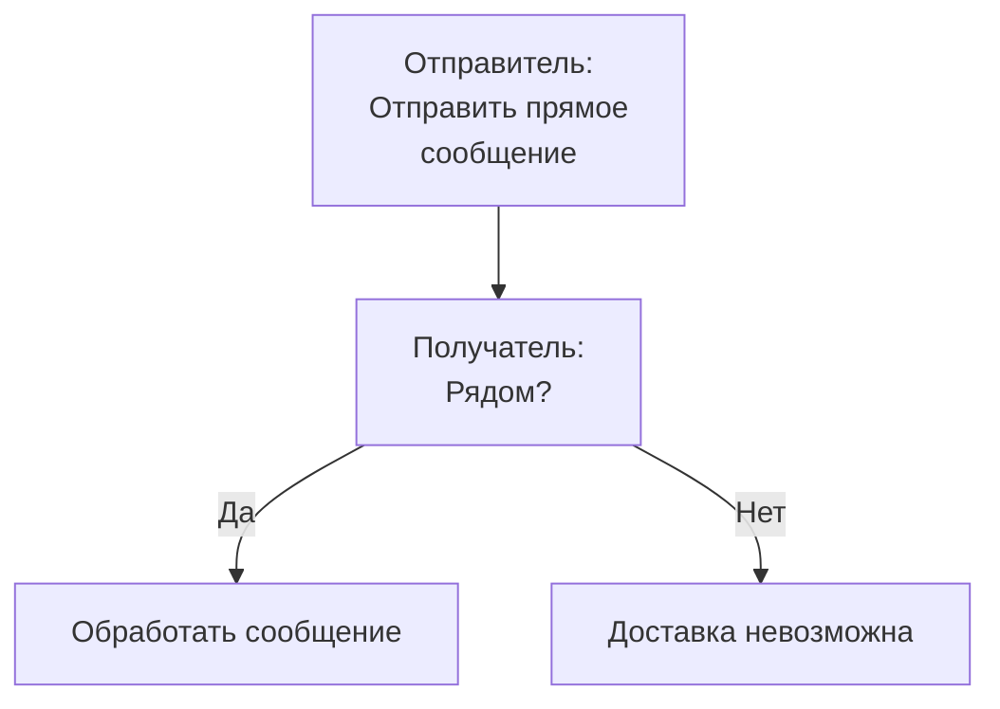

# Потоки прямых сообщений в MeshCore

Этот документ объясняет маршрутизацию прямых сообщений (DM) в MeshCore, рассматривая три сценария:
- Прямое сообщение с заданным путём
- Прямое сообщение как флуд (широковещательная рассылка)
- Прямое сообщение «напрямую» (клиент-клиент, рядом)

## Общая информация

Прямое сообщение (DM) в MeshCore — это защищённый приватный пакет, отправляемый от одного узла другому. Чтобы два узла могли обмениваться прямыми сообщениями, оба должны иметь открытый ключ друг друга и быть добавлены в контакты. Это гарантирует, что только предполагаемые получатели могут расшифровать и проверить сообщения.

**Шифрование и проверка:**
- Отправитель шифрует сообщение с использованием открытого ключа получателя.
- Получатель расшифровывает сообщение с помощью своего закрытого ключа, обеспечивая конфиденциальность и подлинность.
- Этот механизм предотвращает перехват и гарантирует, что только предполагаемый получатель может прочитать сообщение.

**Требование к контактам:**
- Отправитель и получатель должны обменяться открытыми ключами и присутствовать в списках контактов друг друга.
- Обычно это делается в процессе начального рукопожатия или обмена контактами.

**Типы маршрутизации:**
- **Заданный путь (Set Path):** Отправитель указывает список узлов (репитеров), через которые должно пройти сообщение. Только узлы из пути пересылают сообщение; остальные игнорируют его.
- **Флуд (Flood):** Сообщение широковещательно рассылается всем узлам, и каждый репитер пересылает его, пока оно не достигнет адресата или не истечёт TTL.
- **Напрямую (Direct, Nearby):** Сообщение отправляется напрямую от одного клиента другому, если они находятся в зоне действия радиосвязи, без участия репитеров.

Прямые сообщения разработаны для обеспечения приватности, надёжности и гибкости маршрутизации, что делает их подходящими для защищённой связи в mesh-сетях.

---

## 1. Прямое сообщение с заданным путём

---

## 2. Прямое сообщение как флуд

---

## 3. Прямое сообщение «напрямую» (клиент-клиент, рядом)

---

## Итоги

- **Заданный путь:** Только указанные репитеры пересылают сообщение.
- **Флуд:** Все репитеры пересылают сообщение, пока оно не достигнет адресата.
- **Напрямую (рядом):** Сообщение доставляется напрямую, если получатель находится в зоне действия.
